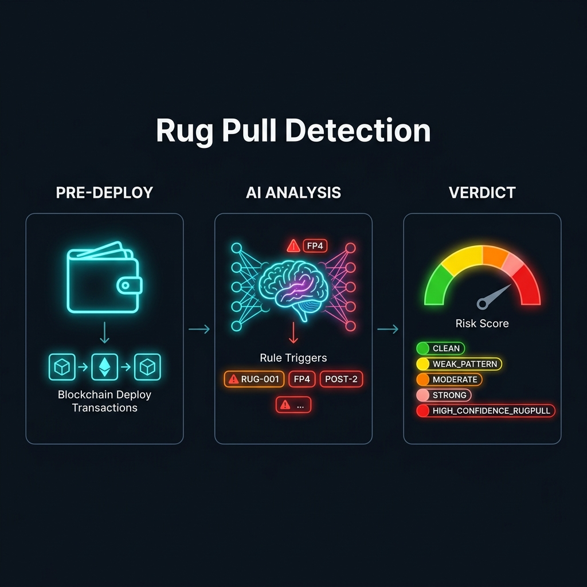
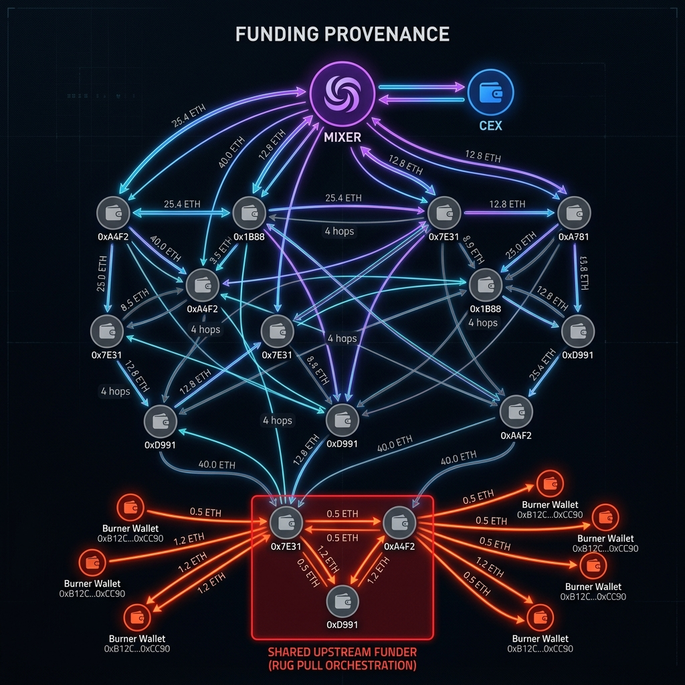
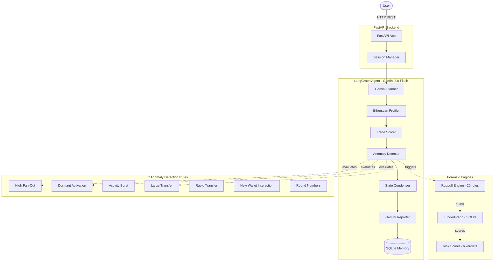

<div align="center">


<br/>

# 🕵️ Single-Agent Blockchain Investigator

### *Stop Rug Pulls Before They Drain a Single Wei*

<br/>

[](https://python.org)
[](https://fastapi.tiangolo.com)
[](https://langchain-ai.github.io/langgraph/)
[](https://deepmind.google/technologies/gemini/)
[](LICENCE)
[](Dockerfile)

<br/>

> **Autonomous. Explainable. Proactive.**
> An AI forensic agent that hunts rug pull deployers by their *preparation* behaviors — long before a liquidity pool is drained.

<br/>

[🚀 Quick Start](#-quick-start) · [🧠 How It Works](#-how-it-works) · [⚖️ Detection Rules](#️-the-20-rule-detection-engine) · [🏗️ Architecture](#️-architecture) · [🔬 Research Tools](#-research--benchmarking-tools) · [🛣️ Roadmap](#️-roadmap)

</div>

---

## 💥 The Problem

DeFi rug pulls stole **$2.7 billion** in 2023 alone. Traditional on-chain tracers only act *after* the drain — when the money is already gone, laundered through mixers, and the deployer has vanished.

**We flipped the model.**

Instead of tracing the crime, we profile the *criminal*. By analyzing a deployer wallet's full transaction history — funding source, timing patterns, contract behavior, and post-deploy cash flow — this agent assigns a structured risk verdict backed by **20 deterministic forensic rules** and a **Gemini-powered narrative report**.

---

## 🧠 How It Works

<div align="center">

</div>

<br/>

The system operates in three simultaneous forensic layers:

### Layer 1 — Pre-Deploy Behavioral Triage
Examines the *creator wallet* before and during contract deployment.

| Signal | What It Catches |
|--------|-----------------|
| 🔥 **Burner Wallet Age** | Wallet created minutes before deployment — classic burner pattern |
| 🤖 **Scripted Funding CV** | Mathematically proves automated funding via Coefficient of Variation |
| 🧪 **Missing Dry-Run** | Deployers who never tested on testnet — directly to mainnet malice |
| 📦 **High Deploy Volume** | Serial deployers launching mass-spam contracts |
| 🔑 **Ownership Transfer** | Immediate renouncement or suspicious multi-hop handoff post-deploy |

### Layer 2 — Funding Provenance Graphing

<div align="center">

</div>

<br/>

Malicious actors are backed by syndicates. Our **FunderGraph** engine builds a persistent SQLite network graph to expose them:

| Rule | Signal | Severity |
|------|--------|----------|
| `RUG-FP1` | First inbound ETH from Mixer / Tornado Cash | 🔴 HIGH |
| `RUG-FP2` | ≥4 hops from any known exchange/entity | 🔴 HIGH |
| `RUG-FP3` | ≥50% of seed capital is "fresh" (never touched known entity) | 🔴 HIGH → CRITICAL |
| `RUG-FP4` | Multiple deployer wallets share the same upstream funder | 🚨 CRITICAL |
| `RUG-FP5` | Structuring detected — abnormal seed amounts to avoid detection | 🟡 MEDIUM |

### Layer 3 — Post-Deploy Cash-Out Pattern Analysis

Seven rules that mathematically fingerprint how proceeds are extracted *after* deployment:

| Rule | Signal | Severity |
|------|--------|----------|
| `POST-1` | Liquidity drained within seconds/minutes of LP creation | 🔴 HIGH → CRITICAL |
| `POST-2` | Full treasury sweep — wallet balance → near zero | 🔴 HIGH → CRITICAL |
| `POST-3` | Fragmentation layering: proceeds split into many micro-sends | 🔴 HIGH |
| `POST-4` | Destination diversity scatter — mule wallet dispersion | 🔴 HIGH → CRITICAL |
| `POST-5` | CEX / Mixer concentration of exit flows | 🔴 HIGH → CRITICAL |
| `POST-6` | Token swap or LP dump before cash-out | 🔴 HIGH → CRITICAL |
| `POST-7` | Retained proceeds near zero — full drainage confirmed | 🔴 HIGH → CRITICAL |

---

## 🏗️ Architecture



---

## 📊 Verdict System

The engine outputs one of **6 structured verdicts**, each backed by a scored evidence chain:

```
╔══════════════════════════════════════════════════════════════════╗
║  VERDICT                          COLOUR    SCORE RANGE          ║
╠══════════════════════════════════════════════════════════════════╣
║  ✅ CLEAN                          GREEN     0 – 20              ║
║  ℹ️  INSUFFICIENT_DATA             CYAN      N/A (sparse wallet) ║
║  ⚠️  WEAK_PATTERN                  YELLOW    21 – 40             ║
║  🟠 MODERATE_PATTERN               ORANGE    41 – 60             ║
║  🔴 STRONG_PATTERN                 RED       61 – 80             ║
║  🚨 HIGH_CONFIDENCE_RUGPULL        BRIGHT RED 81+                ║
╚══════════════════════════════════════════════════════════════════╝
```

Every verdict is accompanied by a Gemini-generated **Observation → Evidence → Reasoning** chain — no black boxes.

---

## 🚀 Quick Start

**1. Clone & Setup**
```bash
git clone https://github.com/dyno-dr/single-agent-blockchain-investigator.git
cd single-agent-blockchain-investigator
python -m venv venv
source venv/bin/activate       # Windows: venv\Scripts\activate
pip install -r requirements.txt
```

**2. Configure Environment**
```bash
cp .env.example .env
# Add your keys:
# ETHERSCAN_API_KEY=your_key_here
# GOOGLE_API_KEY=your_gemini_key_here
```

**3. Launch the Backend**
```bash
uvicorn backend.main:app --reload --host 0.0.0.0 --port 8000
```
> API docs auto-available at `http://localhost:8000/docs`

**4. Open the UI**
```
Open frontend/index.html in your browser.
No Node.js, no build step — just open and go.
```

**5. CLI — Single Address (Fastest)**
```bash
python test_rugpull.py 0xYourTargetAddress --fetch
```

**6. Docker (Optional)**
```bash
docker-compose up --build
```

---

## ⚖️ The 20-Rule Detection Engine

<details>
<summary><b>📋 Click to expand — Full Rule Register</b></summary>

### 🔴 Pre-Deploy Rules (Behavioral)

| ID | Name | Feature | Severity |
|----|------|---------|----------|
| `RUG-001` | Extreme Burner Wallet | Wallet age < 15 min before deploy | LOW |
| `RUG-002` | Scripted Funding CV | Funding gap CV below human threshold | HIGH / MEDIUM |
| `RUG-003` | Dry-Run Activity | Zero testnet deployments detected | HIGH / MEDIUM |
| `RUG-004` | High Deployment Volume | > threshold contracts deployed | HIGH / MEDIUM |
| `RUG-005` | Scripted Timing Entropy | Inter-tx entropy below threshold | LOW |
| `RUG-NEW-A` | Single-Deploy Burner | Exactly 1 deployment, then wallet goes dark | MEDIUM |
| `RUG-NEW-B` | Ownership Transfer | Multi-hop transfer immediately post-deploy | HIGH |

### 🕸️ Funding Provenance Rules (FP Series)

| ID | Name | Signal | Severity |
|----|------|--------|----------|
| `RUG-FP1` | Mixer/Bridge Origin | First inbound from Tornado Cash or bridge | HIGH |
| `RUG-FP2` | Deep Hop Count | ≥4 hops from any named entity | HIGH |
| `RUG-FP3` | Fresh Capital Fraction | ≥50% seed capital untraceable | HIGH / CRITICAL |
| `RUG-FP4` | Shared Upstream Funders | Cross-wallet coordination detected | CRITICAL |
| `RUG-FP5` | Structuring Detection | Abnormal seed amounts (smurfing) | MEDIUM |

### 💸 Post-Deploy Cash-Out Rules (POST Series)

| ID | Name | Signal | Severity |
|----|------|--------|----------|
| `RUG-POST-1` | Immediate Liquidity Drain | LP drained within minutes of creation | HIGH / CRITICAL |
| `RUG-POST-2` | Treasury Sweep | Full balance withdrawal pattern | MEDIUM / CRITICAL |
| `RUG-POST-3` | Fragmentation / Layering | High outflow CV (scripted splitting) | HIGH |
| `RUG-POST-4` | Mule Scatter | Destination diversity beyond normal | MEDIUM / CRITICAL |
| `RUG-POST-5` | Exchange/Mixer Exit | Proceeds concentrated to CEX/mixer | HIGH / CRITICAL |
| `RUG-POST-6` | Swap-Before-Cashout | Token swap / LP dump before exit | HIGH / CRITICAL |
| `RUG-POST-7` | Near-Zero Retained | < threshold ETH retained post-cashout | HIGH / CRITICAL |

### 🔍 Anomaly Detection Rules (On-Chain Behavior)

| ID | Name | Signal |
|----|------|--------|
| `ANOM-001` | High Fan-Out | Burst sends to many new wallets |
| `ANOM-002` | Dormant Activation | Wallet inactive for months, then suddenly active |
| `ANOM-003` | Activity Burst | Spike in tx frequency above baseline |
| `ANOM-004` | Large Transfer | Single transfer > threshold ETH |
| `ANOM-005` | Rapid Transfer | Inbound → outbound within seconds |
| `ANOM-006` | New Wallet Interaction | Sends to brand-new (< 24hr old) wallets |
| `ANOM-007` | Round Numbers | Statistically improbable round-number transfers |

</details>

---

## 🎨 Frontend UI

The project ships a **zero-dependency glassmorphism web dashboard** — no React, no Node.js, no build pipeline.

- 🌑 **Dark Mode First** — neon cyan/purple glassmorphic design
- 🔄 **Real-Time Polling** — watch the agent reason live step-by-step
- 📋 **Structured Reports** — Observation / Evidence / Reasoning chains rendered beautifully
- 📱 **Responsive** — works on desktop and tablet

```
frontend/
├── index.html   ← Single-file app shell
├── app.js       ← Polling engine + report renderer  
└── styles.css   ← Glassmorphism CSS design system
```

---

## 🔬 Research & Benchmarking Tools

The framework ships production-quality benchmarking CLI tools used to validate the 20-rule system against **92 confirmed rug pull wallets** and **18 genuine deployer wallets**:

```bash
# Run the full 110-wallet validation dataset
python test_full_dataset.py --fetch

# Deep single-address report with all funding provenance hops
python test_funding_provenance.py 0xABC...

# Live batch scoring (reads from eoa_addresses.txt)
python rugpull_live_batch.py

# Test LangGraph full agent pipeline
python test_langgraph.py 0xABC...

# Interactive CLI — single address, full report
python test_rugpull.py 0xABC... --fetch

# Run known rugpull / genuine addresses for quick sanity check
python test_rugpull.py --known
```

---

## 📁 Project Structure

```
blockchain-investigator-project/
│
├── backend/
│   ├── agent/                    # LangGraph pipeline
│   │   ├── graph.py              # 6-node state machine
│   │   ├── state.py              # Typed AgentState
│   │   ├── state_condenser.py    # Context-safe state compression
│   │   ├── session_manager.py    # Session lifecycle management
│   │   └── nodes/                # Individual agent nodes
│   │
│   ├── forensics/
│   │   ├── rugpull/
│   │   │   ├── engine.py         # Orchestrates all 20 rules
│   │   │   ├── extractor.py      # Feature vector extraction
│   │   │   ├── rules.py          # All 20 forensic rules (1350+ lines)
│   │   │   ├── funding_graph.py  # FunderGraph SQLite engine
│   │   │   └── scorer.py         # 6-tier verdict scoring
│   │   └── rules/                # 7 anomaly detection rules
│   │
│   ├── blockchain/               # Etherscan client, normalizer, entity DB
│   ├── api/                      # FastAPI routers & endpoints
│   ├── persistence/              # SQLite session storage
│   └── main.py                   # App entrypoint
│
├── frontend/                     # Glassmorphism web UI
├── scripts/                      # Threshold derivation scripts
├── data/                         # Known entity databases
├── cli_utils.py                  # Shared Etherscan fetch utilities
├── eoa_addresses.txt             # 92 confirmed rugpull addresses
├── docker-compose.yml
└── pyproject.toml
```

---

## 🛣️ Roadmap

| Phase | Status | Feature |
|-------|--------|---------|
| Phase 1 | ✅ Done | Infrastructure — FastAPI, SQLite, Logging |
| Phase 2 | ✅ Done | Blockchain Data Layer — Etherscan v2, Normalizer |
| Phase 3 | ✅ Done | LangGraph Agent — 6-node pipeline, 7 anomaly rules |
| Phase 4 | ✅ Done | Rugpull Engine — 7 pre-deploy behavioral rules |
| Phase 5 | ✅ Done | Funding Provenance — FunderGraph, 5 FP rules |
| Phase 6 | ✅ Done | Post-Deploy Analysis — 7 cash-out pattern rules |
| Phase 7 | ✅ Done | Glassmorphism Frontend UI |
| Phase 8 | ✅ Done | State Condenser — context-safe LLM boundary management |
| Phase 9 | 🔲 Planned | WebSocket live streaming of agent thought process |
| Phase 10 | 🔲 Planned | Token/ERC-20 transfer analysis (not just ETH) |
| Phase 11 | 🔲 Planned | Multi-Agent expansion — AML Compliance Agent |
| Phase 12 | 🔲 Planned | Neo4j Knowledge Graph for cross-investigation linking |

---

## 📚 Academic Context

Designed from the ground up for the **Multi-Agent Blockchain Forensics Research Programme**. The architecture prioritizes **Explainable AI (XAI)** over black-box ML predictions — every finding mandates a structured `Observation → Evidence → Reasoning` chain that is fully auditable.

The 20-rule system was calibrated empirically against a labeled dataset of **92 rug pull EOA creators** and **18 genuine deployers**, with thresholds derived via statistical distribution analysis (see `scripts/derive_rugpull_thresholds_v2.py`).

Features intentionally **not triggered** (hypotheses invalidated by data):
- `F7` within-wallet similarity — genuine deployers score *higher* than rug pulls
- `F4` burstiness — same inversion
- `F5` nonce entropy — statistically too weak (Δ = 0.09 bits)

**If you use this in research, please cite:**
```bibtex
@software{blockchain_investigator_2025,
  title  = {Single-Agent Blockchain Investigator},
  author = {Dyno Dr},
  year   = {2025},
  url    = {https://github.com/dyno-dr/single-agent-blockchain-investigator}
}
```

---

## 🤝 Contributing

Contributions welcome! Please read [CONTRIBUTING.md](CONTRIBUTING.md) first. Security disclosures: see [SECURITY.md](SECURITY.md).

---

<div align="center">

**MIT License** · Built for research · Designed for extensibility

*Agent Zero of a multi-agent future.*

<br/>

[](https://github.com/dyno-dr/single-agent-blockchain-investigator/stargazers)
[](https://github.com/dyno-dr/single-agent-blockchain-investigator/network/members)

</div>