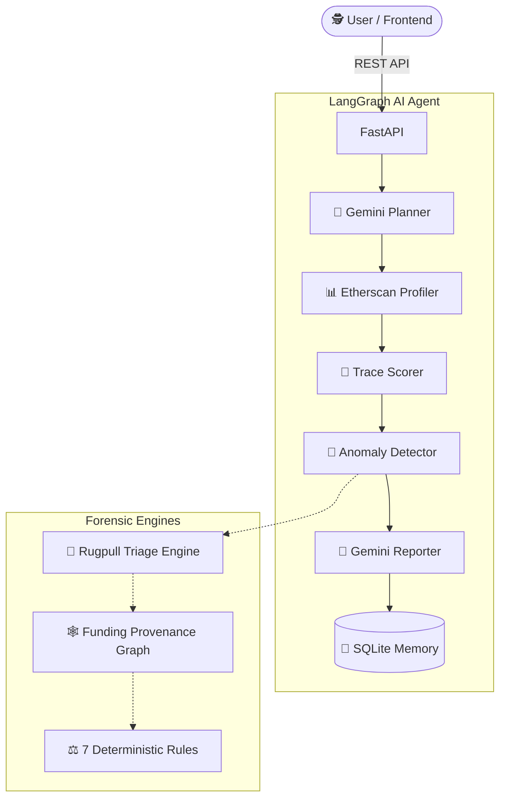

<div align="center">


# 🕵️ Single-Agent Blockchain Investigator

**Next-Generation Autonomous Forensics Powered by LangGraph & Gemini AI**

[](https://python.org)
[](https://fastapi.tiangolo.com)
[](https://langchain-ai.github.io/langgraph/)
[](https://deepmind.google/technologies/gemini/)

*Agent Zero of the upcoming Multi-Agent Blockchain Forensics Framework.*

</div>

<br/>

> 💡 **The Mission:** 
> Stop financial crime *before* it happens. Instead of relying on post-incident tracing, this AI agent acts as a proactive forensic investigator—hunting for anomalous behavioral markers, tracing funding provenance, and mathematically scoring risk. Every decision is auditable, explainable, and logged.

<br/>

---

## 🌟 Core Innovations

### 🧠 Autonomous LangGraph Pipeline
A state-of-the-art 6-node LangGraph architecture utilizing **Google's Gemini 2.0 Flash**. The agent dynamically:
1. **Profiles** target wallets using raw Etherscan data.
2. **Plans** deterministic tracing strategies.
3. **Detects** anomalies using 7 deterministic forensic algorithms (e.g., *High Fan-Out*, *Dormant Activation*, *Layering*).
4. **Condenses** massive state histories into context-safe report boundaries, ensuring the LLM never hallucinates due to context exhaustion.

### 🛑 Pre-Deployment Rugpull Triage
Why wait for a liquidity pool to be drained? The **Rugpull Engine** identifies malicious contract deployers based on their *preparation* behaviors.
* **No Dry-Runs:** Flags deployers pushing directly to mainnet without testnet validation.
* **Fast Bursts & Immediate Clones:** Identifies spam-contract deployment patterns.
* **Ownership Transfers:** Flags immediate renouncements or suspicious handoffs.

### 🕸️ Funding Provenance Graphing (The Syndicate Hunter)
A powerful new addition to our forensics toolkit. Malicious actors rarely operate in isolation—they are funded by scripted syndicates. 
Our **Funding Provenance Engine** builds a localized `FunderGraph` in SQLite to:
* Extract exact **Centralized Exchange (CEX)** or **Mixer** origins.
* Calculate the **Coefficient of Variation (CV)** for funding gap times, mathematically proving when a wallet was funded by an automated script rather than a human.
* Traverse deep multi-hop graphs to uncover the hidden financial networks backing fraudulent deployments.

### 📊 Advanced Batch Analytics
Researchers can evaluate hundreds of wallets simultaneously. The built-in **Advanced Batch Analyzer** leverages Pandas and Seaborn to automatically generate beautiful, publication-ready distributions of threat scores, verdict breakdowns, and triggered rule frequencies.

### 🎨 Stunning Glassmorphism Dashboard
Gone are the days of boring terminal outputs. The project ships with a **beautiful Vanilla JS & HTML5 web interface**. Featuring a sleek dark-mode, glassmorphic design, and real-time polling—allowing you to watch the agent reason through an investigation live.

<br/>

---

## 🏗️ System Architecture



<br/>

---

## 🚀 Quick Start Guide

**1. Clone & Setup**
```bash
git clone https://github.com/<your-username>/single-agent-blockchain-investigator.git
cd single-agent-blockchain-investigator
python -m venv venv
source venv/bin/activate  # On Windows use: venv\Scripts\activate
pip install -r requirements.txt
```

**2. Configure Environment**
```bash
cp .env.example .env
```
*Add your `ETHERSCAN_API_KEY` and `GOOGLE_API_KEY` to the `.env` file.*

**3. Launch the Backend**
```bash
uvicorn backend.main:app --reload --host 0.0.0.0 --port 8000
```

**4. Launch the Beautiful UI**
Simply open `frontend/index.html` in your favorite web browser. No complex Node.js build steps required! Enter a wallet address and let the agent do the heavy lifting.

<br/>

---

## 🔬 Analytical & Research Tools

For data scientists and blockchain researchers, the framework includes powerful benchmarking utilities:

**Run the Full Dataset with Provenance Tracking:**
```bash
python test_full_dataset.py --fetch
```

**Generate Visual Analytics (Seaborn/Pandas):**
```bash
python advanced_batch_analyzer.py
```
*Automatically generates `analysis_verdicts.png`, `analysis_rules.png`, and `analysis_scores.png` to beautifully visualize the agent's performance across batches.*

**Test the LangGraph Engine via CLI:**
```bash
python test_langgraph.py 0xYourWalletAddressHere
```

<br/>

---

## 🛣️ Roadmap

- **Phase 1** ✅ Infrastructure (FastAPI, DB, Logging)
- **Phase 2** ✅ Blockchain Data Layer (Etherscan, Normalizer)
- **Phase 3** ✅ Agent Layer (LangGraph pipeline, 7 forensic rules)
- **Phase 4** ✅ Pre-Deployment Rugpull & Funding Provenance Graphing
- **Phase 5** ✅ Glassmorphism Frontend UI 
- **Phase 6** 🔲 WebSocket live streaming of agent thoughts
- **Phase 7** 🔲 Multi-Agent Expansion (AML Compliance Agent, Neo4j Knowledge Graph Agent)

<br/>

---

## 📚 Academic & Research Context

Designed from the ground up for the **Multi-Agent Blockchain Forensics Research Programme**, this architecture prioritizes Explainable AI (XAI) over black-box predictions. Every finding mandates a logical `Observation → Evidence → Reasoning` chain.

**If you use this framework in your research, please cite:**
```bibtex
@software{blockchain_investigator_2025,
  title  = {Single-Agent Blockchain Investigator},
  author = {Dyno Dr},
  year   = {2025},
  url    = {https://github.com/dyno-dr/single-agent-blockchain-investigator}
}
```

<br/>

<div align="center">
<b>MIT License</b><br/>
<sub>Built for research. Designed for extensibility. Agent Zero of a multi-agent future.</sub>
</div>